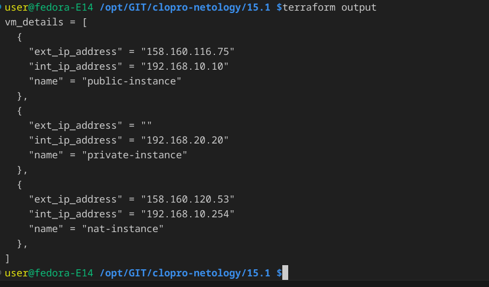
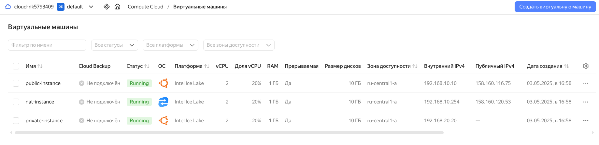
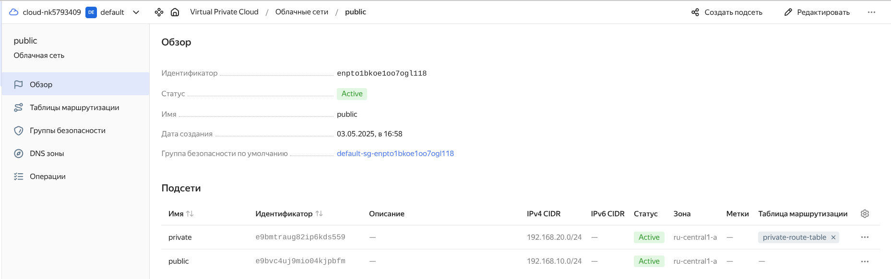
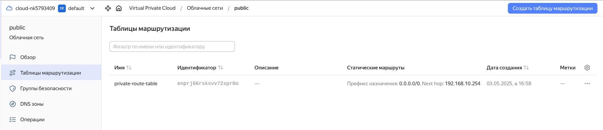
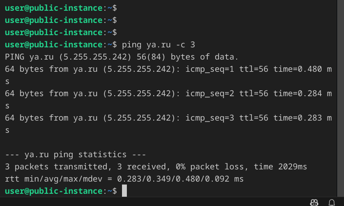
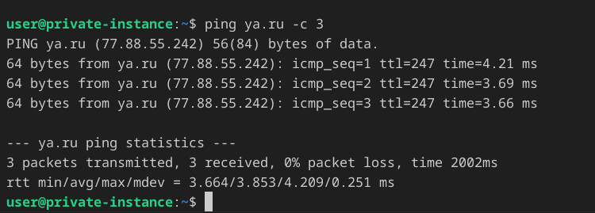

## Задание 1. Yandex Cloud
### Что нужно сделать

1. Создать пустую VPC. Выбрать зону.

Три VPS в различных subnet

Subnets & Routing

2. Публичная подсеть.
- Создать в VPC subnet с названием public, сетью 192.168.10.0/24.
- Создать в этой подсети NAT-инстанс, присвоив ему адрес 192.168.10.254. В качестве image_id использовать fd80mrhj8fl2oe87o4e1.
- Создать в этой публичной подсети виртуалку с публичным IP, подключиться к ней и убедиться, что есть доступ к интернету.
  

1. Приватная подсеть.
- Создать в VPC subnet с названием private, сетью 192.168.20.0/24.
- Создать route table. Добавить статический маршрут, направляющий весь исходящий трафик private сети в NAT-инстанс.
- Создать в этой приватной подсети виртуалку с внутренним IP, подключиться к ней через виртуалку, созданную ранее, и убедиться, что есть доступ к интернету.

