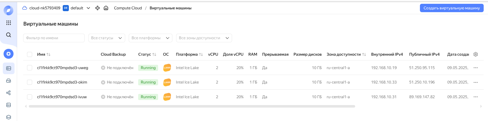

## Задание 1. Yandex Cloud

1. Создать бакет Object Storage и разместить в нём файл с картинкой:
- Создать бакет в Object Storage с произвольным именем (например, имя_студента_дата).
- Положить в бакет файл с картинкой.
- Сделать файл доступным из интернета.

**доступ разрешен на уровне bucket**

 **файл загружен и доступен по ссылке https://storage.yandexcloud.net/kovtykh-nk-student-2025/image123.png**

1. Создать группу ВМ в public подсети фиксированного размера с шаблоном LAMP и веб-страницей, содержащей ссылку на картинку из бакета:
- Создать Instance Group с тремя ВМ и шаблоном LAMP. Для LAMP рекомендуется использовать image_id = fd827b91d99psvq5fjit.
- Для создания стартовой веб-страницы рекомендуется использовать раздел user_data в meta_data.
- Разместить в стартовой веб-странице шаблонной ВМ ссылку на картинку из бакета.
- Настроить проверку состояния ВМ.

1. Подключить группу к сетевому балансировщику:
- Создать сетевой балансировщик.
- Проверить работоспособность, удалив одну или несколько ВМ.

**доступ с LAMP**

**доступ с балансировщика web-balance**
